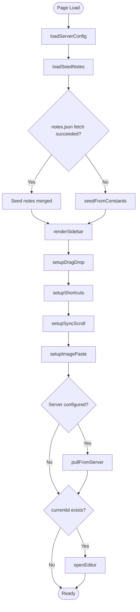
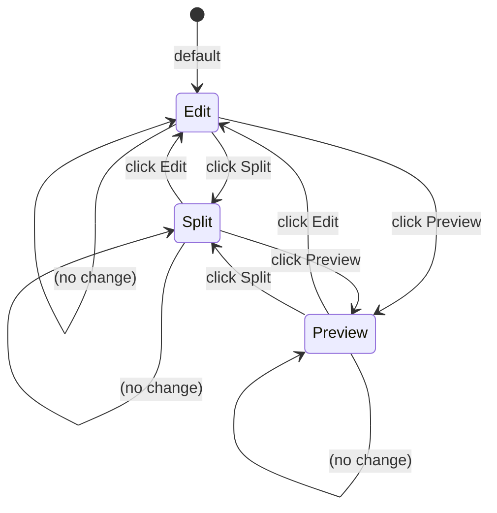

# Noted — Complete Design Document

**Version:** 1.0.0  
**Author:** Ahmed Sabek  
**Course:** Software Engineering — Design Patterns & Construction Design  
**Live URL:** https://AHMED99SABEK.github.io/noted/  
**Worker API:** https://noted-server.ahmedsabek370.workers.dev  

---

## Table of Contents

1. [Introduction & Purpose](#1-introduction--purpose)
2. [Requirements Specification](#2-requirements-specification)
3. [System Architecture](#3-system-architecture)
4. [User Interface Design](#4-user-interface-design)
5. [Object-Oriented & Modular Design](#5-object-oriented--modular-design)
6. [Design Patterns Applied](#6-design-patterns-applied)
7. [Data Design](#7-data-design)
8. [Construction Design (Flow, State, Tables)](#8-construction-design)
9. [Deployment Architecture](#9-deployment-architecture)
10. [Error Handling & Testing](#10-error-handling--testing)

---

## 1. Introduction & Purpose

### 1.1 What Is Noted?

Noted is a single-file, client-side markdown note-taking application designed for students, developers, and anyone who needs to write formatted notes with diagrams, recordings, and cross-device sync — without signing up for a proprietary service.

### 1.2 Design Goals

| Goal | Priority | Rationale |
|------|----------|-----------|
| Zero-dependency client | High | Open `index.html` in any browser — no npm, bundlers, or servers |
| Privacy-first | High | Personal notes stored in user's browser; server sync is opt-in and API-key-gated |
| Rich content | High | Must support diagrams (Mermaid), recordings (voice/video), code blocks, tables |
| Portable storage | Medium | Notes stored as JSON — easily backed up, migrated, or edited externally |
| Cross-device sync | Medium | Optional cloud backend for syncing between devices without a third-party account |

### 1.3 Scope

**In scope:**
- Markdown editing with live preview
- Mermaid diagram rendering in dark theme
- Audio/video recording with speech-to-text transcription
- Export: Markdown, PDF, JSON
- Import: Markdown (single file), JSON (bulk), clipboard images
- Search, auto-save, keyboard shortcuts
- Optional server sync via Cloudflare Workers + D1

**Out of scope:**
- Real-time collaboration (no WebSocket/OT/CRDT)
- User accounts or authentication provider integrations
- Mobile native apps (responsive web only)
- Plugin or extension system

---

## 2. Requirements Specification

### 2.1 Functional Requirements

| ID | Requirement | Implementation |
|----|-------------|----------------|
| F1 | Create, read, update, delete notes | `newNote()`, `loadNote()`, `onEditorChange()`, `deleteNote()` |
| F2 | Persist notes across sessions | `localStorage` key `noted_notes` — full array serialized as JSON |
| F3 | Render markdown to HTML | `marked.js` v9.1.6 via `marked.parse()` in `updatePreview()` |
| F4 | Render Mermaid diagrams in dark theme | `mermaid.render()` per `<code class="language-mermaid">` block |
| F5 | Record audio inline | `MediaRecorder` with `audio/webm` codec |
| F6 | Record video inline | `MediaRecorder` with `video/webm` codec |
| F7 | Transcribe speech to text | Web Speech API (`SpeechRecognition`) — continuous, English |
| F8 | Export single note as Markdown | `exportMd()` — creates a Blob download |
| F9 | Export all notes as JSON | `exportJson()` — full notes array as JSON download |
| F10 | Export as PDF | `exportPdf()` — opens styled print popup with rendered SVGs |
| F11 | Import Markdown files | `importFile()` — file picker or drag-and-drop, extracts title from `# H1` |
| F12 | Import JSON backup | `importJson()` — merges by title, skips duplicates |
| F13 | Paste clipboard images | `setupImagePaste()` — converts to base64 data URI |
| F14 | Search notes by title | `onSearch()` — real-time filter on sidebar list |
| F15 | Sync notes to remote server | `syncNotesToServer()` — `PUT /api/notes` bulk upsert |
| F16 | Pull notes from remote server | `pullFromServer()` — fetch and merge with timestamp conflict resolution |
| F17 | Test server connection | `testConnection()` — `GET /api/health` with green/red indicator |

### 2.2 Non-Functional Requirements

| ID | Requirement | Target |
|----|-------------|--------|
| NFR1 | Startup time | Under 500ms on modern hardware (single HTML file, no network requests for core JS) |
| NFR2 | Auto-save latency | Debounced at 2 seconds after last keystroke |
| NFR3 | Mermaid render limit | Per-diagram error isolation — one bad diagram doesn't break others |
| NFR4 | Offline capability | Full functionality without internet (except Mermaid CDN and server sync) |
| NFR5 | Storage limit | Bounded only by browser `localStorage` quota (~5–10 MB) |
| NFR6 | Server auth | Bearer token compared in constant time against single `API_KEY` secret |

---

## 3. System Architecture

### 3.1 High-Level Architecture

```
+-------------------+         +-------------------+
|                   |         |                   |
|   Browser (GH     |  HTTPS  |   Cloudflare      |
|   Pages / local)  |<------->|   Worker          |
|                   |         |                   |
|   index.html      |         |   src/index.js    |
|   (single file)   |         |                   |
|                   |         |   +-- D1 (SQLite) |
+-------------------+         +-------------------+
        |
        | localStorage
        v
   Browser Storage
   (noted_notes,
    noted_server_url,
    noted_api_key)
```

### 3.2 Client-Side Component Model

The frontend uses a **modular monolithic** pattern — all code lives in a single `<script>` block but is organized into logical modules:

```
index.html
├── HTML (semantic structure)
│   ├── header (logo, view toggles, tools)
│   ├── main
│   │   ├── sidebar (note list, search, import zone)
│   │   └── editor area (title input, editor textarea, preview div)
│   ├── recordings panel (collapsible)
│   ├── settings modal (server URL, API key, connection test)
│   └── status bar (word count, save status)
├── CSS (inline <style>)
│   ├── CSS custom properties (dark theme palette)
│   ├── layout (flexbox, responsive breakpoints)
│   ├── component styles (sidebar, editor, preview, modals)
│   └── print styles (@media print)
└── JavaScript (inline <script>)
    ├── Data layer (notes array, localStorage CRUD)
    ├── Rendering (sidebar, editor, preview, recordings)
    ├── Media (recording, transcription, playback)
    ├── Import/Export (Markdown, JSON, PDF)
    ├── Server sync (fetch wrapper, push, pull, conflict resolution)
    ├── Event handlers (keyboard shortcuts, drag-drop, paste)
    └── Initialization (IIFE bootstrap sequence)
```

### 3.3 Server-Side Component Model

The backend is a single Cloudflare Worker with function-per-route organization:

```
src/index.js
├── CORS middleware (OPTIONS handler)
├── Auth middleware (Bearer token check)
├── Router (path + method dispatch)
│   ├── GET  /api/health       → { status: "ok" }
│   ├── GET  /api/notes        → SELECT id, title, updated
│   ├── POST /api/notes        → INSERT with UUID
│   ├── PUT  /api/notes        → Bulk upsert with timestamp guard
│   ├── GET  /api/notes/:id    → SELECT * WHERE id = ?
│   ├── PUT  /api/notes/:id    → UPDATE title, content, updated
│   └── DELETE /api/notes/:id  → DELETE WHERE id = ?
├── Utilities
│   ├── genId()  → UUID v4 (crypto.getRandomValues)
│   ├── json(body, status)  → Response wrapper
│   └── auth(request, env)  → Bearer token validation
```

---

## 4. User Interface Design

### 4.1 Layout Structure

```
+-------------------------------------------------------+
| [logo] Noted    [View: Edit|Split|Preview]  [⚙] [ℹ]  |
+---------------------------+---------------------------+
| Sidebar (220px)           | Editor / Preview Area     |
|                           |                           |
| [+ New Note]              | [Note Title Input]        |
| [Search...]               | [                         |
|                           |  Editor Textarea           |
| • Chapter 6 - Creational |  (markdown source)          |
| • Chapter 7 - Structural |  — or —                    |
| • DNS Explainer           |  Live Preview             |
|                           |  (rendered HTML)          |
| [Import Zone]             |                           |
|                           |                           |
+---------------------------+---------------------------+
| Word count: 1,234  |  Status: auto-saved             |
+-------------------------------------------------------+
```

### 4.2 Responsive Breakpoints

| Breakpoint | Layout Behavior |
|------------|-----------------|
| ≥ 1024px | Full desktop: side-by-side sidebar + editor |
| 768–1023px | Narrower sidebar (160px), smaller fonts |
| < 768px | Mobile: hamburger overlay sidebar, full-width editor |
| Print | Hides sidebar, header, status bar — only preview content with diagrams |

### 4.3 Three View Modes

| Mode | Editor Visible | Preview Visible | Use Case |
|------|----------------|-----------------|----------|
| **Edit** | Yes (full width) | No | Writing focused |
| **Split** | Yes (50%) | Yes (50%) | Writing with live feedback |
| **Preview** | No | Yes (full width) | Reading / presenting |

---

## 5. Object-Oriented & Modular Design

### 5.1 Module Responsibilities

While JavaScript has no classes for the core app logic, the code is organized into cohesive modules around single responsibilities:

| Module | Global Variables | Key Functions | Responsibility |
|--------|-----------------|---------------|----------------|
| **Data** | `notes`, `currentId` | `saveAll()`, `genId()` | Notes CRUD, persistence |
| **Sidebar** | — | `renderSidebar()`, `onSearch()` | Note list rendering |
| **Editor** | `currentView` | `openEditor()`, `setView()`, `updatePreview()` | Content editing + preview |
| **Recording** | `mediaRecorder`, `audioChunks`, `recordings`, `isRecording`, `isVideoRecording` | `toggleRecording()`, `toggleVideoRecording()`, `addRecording()` | Media capture + playback |
| **Transcription** | `recognition`, `transcriptText`, `recordingTranscripts` | `startTranscription()`, `stopTranscription()` | Speech-to-text |
| **Import/Export** | — | `exportMd()`, `exportJson()`, `importJson()`, `exportPdf()`, `importFile()` | File I/O |
| **Server Sync** | `serverUrl`, `apiKey` | `syncNotesToServer()`, `pullFromServer()`, `testConnection()` | Remote persistence |
| **Init** | — | IIFE at end of script | Bootstrap sequence |
| **Backend** | (Worker) | Route handlers + auth | REST API |

### 5.2 Cohesion & Coupling

- **High cohesion** within each module: all functions in the Recording module deal only with `MediaRecorder` lifecycle; all Server Sync functions deal only with the fetch-and-merge cycle.
- **Loose coupling** between modules: modules communicate through the shared `notes` array and explicit callbacks (e.g., `saveAll()` is called by both Editor and Data modules).
- **Shared state** via global variables (a pragmatic choice for a single-file app) — the `notes` array is the single source of truth.

---

## 6. Design Patterns Applied

### 6.1 Singleton (Browser Storage)

**Context:** The app needs exactly one authoritative copy of the notes data at any time, accessible from all modules.

**Implementation:**
- The `notes` array is a module-level global variable loaded once on startup from `localStorage`.
- All module functions read from and write to the same `notes` reference.
- `saveAll()` serializes this single instance back to `localStorage`.

```js
// Singleton access pattern
let notes = JSON.parse(localStorage.getItem('noted_notes') || '[]');
// Every module reads/writes the same `notes` array
```

**Why not a class?** The single-file, no-build-step constraint makes a global variable the simplest Singleton implementation. A class wrapper would add ceremony without benefit here.

### 6.2 Adapter (Markdown → HTML)

**Context:** The `marked.js` library provides markdown-to-HTML conversion, but the app needs to post-process the output to render Mermaid diagrams and apply custom styling.

**Implementation:**
- `marked.parse(content)` produces raw HTML.
- The app then queries for `<code class="language-mermaid">` elements and replaces each with a rendered SVG via `mermaid.render()`.
- A `mermaid-wrapper` div is added for print layout control.

```js
function updatePreview() {
  const content = document.getElementById('editor').value;
  const preview = document.getElementById('preview');
  preview.innerHTML = marked.parse(content);           // Step 1: markdown → HTML
  preview.querySelectorAll('pre code.language-mermaid')  // Step 2: find diagrams
    .forEach(code => renderDiagram(code.textContent));   // Step 3: replace with SVG
}
```

### 6.3 Adapter (Server Communication Layer)

**Context:** The frontend needs to talk to a REST API that expects Bearer auth and JSON bodies. Instead of raw `fetch()` calls scattered everywhere, a single adapter function normalizes the interface.

**Implementation:**
```js
async function serverFetch(path, options = {}) {
  if (!serverUrl || !apiKey) return null;
  const url = serverUrl + path;
  const res = await fetch(url, {
    ...options,
    headers: {
      'Content-Type': 'application/json',
      'Authorization': 'Bearer ' + apiKey,
      ...options.headers,
    },
  });
  if (!res.ok) return null;
  return await res.json();
}
```

All sync functions (`syncNotesToServer()`, `pullFromServer()`, `testConnection()`) go through `serverFetch()`, which adapts the Worker's REST interface into a convenient async function.

### 6.4 Facade (Server API)

**Context:** The Cloudflare Worker exposes multiple endpoints (health, CRUD, bulk upsert). The client-facing sync module (`syncNotesToServer`, `pullFromServer`, `deleteNoteFromServer`) provides a simplified interface that hides the individual endpoint details.

**Implementation:**
```js
async function syncNotesToServer() {
  const payload = notes.map(n => ({
    id: n.id, title: n.title, content: n.content, updated: n.updated
  }));
  return serverFetch('/api/notes', { method: 'PUT', body: JSON.stringify(payload) });
}
```

The client never constructs individual endpoint URLs or handles auth headers directly — the Facade abstracts all that.

### 6.5 Observer (Auto-Save Chain)

**Context:** When the user types, multiple downstream actions should fire: save to localStorage, update preview, update word count, and (optionally) sync to server.

**Implementation:**
```js
function onEditorChange() {
  const note = notes.find(n => n.id === currentId);
  if (!note) return;
  note.content = document.getElementById('editor').value;  // State change
  note.updated = Date.now();
  saveAll();                // Notify storage
  updatePreview();          // Notify preview
  updateWordCount();        // Notify status bar
}
```

`saveAll()` extends the chain: it writes to localStorage, then if a server is configured, kicks off a debounced timer:

```js
function saveAll() {
  localStorage.setItem('noted_notes', JSON.stringify(notes));
  if (serverUrl && apiKey) {
    clearTimeout(window._syncTimer);
    window._syncTimer = setTimeout(() => syncNotesToServer(), 2000);
  }
}
```

### 6.6 Factory Method (Note Creation)

**Context:** Notes can be created in three ways: blank new note, imported from `.md` file, or seeded from `notes.json` / fallback constants. Each follows the same creation pattern (generate ID, set title/content, insert into array, render), but the data source differs.

**Implementation:** `newNote()` is the factory method for blank notes. `importFile()` acts as an alternate factory for file-imported notes. `loadSeedNotes()` / `seedFromConstants()` are factories for seed data. All produce note objects of the same shape `{ id, title, content, updated }`.

---

## 7. Data Design

### 7.1 Client-Side Schema (`localStorage`)

**Key:** `noted_notes`

```
notes: Array<{
  id: string,        // Base36 timestamp + random suffix (e.g., "l9x3k2m1a8b6c")
  title: string,     // Plain text
  content: string,   // Markdown (can include ```mermaid blocks, HTML audio/video)
  updated: number,   // Unix epoch milliseconds
  _seedHash?: string // Internal: content hash for seed deduplication
}>
```

**Supporting Keys:**

| Key | Type | Purpose |
|-----|------|---------|
| `noted_server_url` | `string` | Cloudflare Worker base URL |
| `noted_api_key` | `string` | Bearer token for server auth |

### 7.2 Server-Side Schema (D1 / SQLite)

```sql
CREATE TABLE notes (
  id    TEXT PRIMARY KEY,
  title TEXT NOT NULL DEFAULT '',
  content TEXT NOT NULL DEFAULT '',
  updated INTEGER NOT NULL
);
```

- `id`: UUID v4 (generated server-side with `crypto.getRandomValues()`)
- `title`: denormalized for quick listing (`SELECT id, title, updated FROM notes`)
- `content`: full Markdown body (no size limit on D1)
- `updated`: integer timestamp for conflict resolution

### 7.3 Seed Data (`notes.json`)

Array of `{ title, content }` objects fetched at runtime. Used as the source of truth for initial content across both local and web versions. Fallback constants (`chapter6Note`, `chapter7Note`, `chapter8Note`) are embedded in `index.html` for offline scenarios.

### 7.4 Conflict Resolution Strategy

**Last-write-wins by timestamp.** When pulling from the server:

```js
async function pullFromServer() {
  const list = await serverFetch('/api/notes');
  for (const item of list) {
    const full = await serverFetch(`/api/notes/${item.id}`);
    const existing = notes.find(n => n.id === full.id);
    if (!existing || full.updated > existing.updated) {
      // Server's version is newer or note doesn't exist locally → accept
      ...
    }
    // Local version is newer → keep local, push later
  }
}
```

When pushing: `PUT /api/notes` bulk upserts with `COALESCE` to only overwrite if incoming `updated > existing updated`. This prevents accidentally reverting concurrent edits.

---

## 8. Construction Design

### 8.1 Flow-Based Design (Bootstrap Sequence)

The application initialization follows a strictly ordered flow:



### 8.2 State-Based Design (View Modes)

The editor has three mutually exclusive view modes. Transitions are explicit:



Implementation uses a simple variable check rather than a formal state machine:

```js
function setView(v) {
  currentView = v;
  document.querySelectorAll('.view-btn').forEach(b => b.classList.toggle('active', b.dataset.view === v));
  document.getElementById('editor').style.display = (v === 'preview') ? 'none' : '';
  document.getElementById('preview').style.display = (v === 'edit') ? 'none' : '';
  if (v === 'split') updatePreview();  // Render preview on first split
}
```

### 8.3 Table-Driven Design (Keyboard Shortcuts)

Shortcuts are defined as a mapping and processed generically rather than with conditional chains:

```js
function setupShortcuts() {
  document.addEventListener('keydown', e => {
    const ctrl = e.ctrlKey || e.metaKey;
    if (!ctrl) return;
    const key = e.key.toLowerCase();
    if (key === 'n') { e.preventDefault(); newNote(); }
    else if (key === 's') { e.preventDefault(); saveNote(); }
    else if (key === 'p') { e.preventDefault(); exportPdf(); }
    else if (key === 'd' && e.shiftKey) { e.preventDefault(); deleteNote(currentId); }
  });
}
```

While simple `if-else` chains are used here (acceptable for 4 shortcuts), this could be refactored to a lookup table for extensibility:

```js
const SHORTCUTS = {
  'n': newNote,
  's': saveNote,
  'p': exportPdf,
  'd': () => e.shiftKey && deleteNote(currentId),
};
```

### 8.4 Pseudocode for Key Algorithms

**Conflict-Resolution Merge (pullFromServer):**

```
for each serverNote in serverNotes:
    localNote = find note by id in local notes array
    if localNote is null:
        add serverNote to local notes
    else if serverNote.updated > localNote.updated:
        replace localNote content with serverNote content
    else:
        // local is newer, do nothing (will be pushed later)
```

**Bulk Upsert (server-side):**

```
for each incomingNote in payload:
    existingNote = SELECT * FROM notes WHERE id = incomingNote.id
    if existingNote is null:
        INSERT INTO notes VALUES (incomingNote.id, ...)
    else if incomingNote.updated > existingNote.updated:
        UPDATE notes SET title=incoming.title, ... WHERE id = incoming.id
    else:
        // existing is newer, skip
```

---

## 9. Deployment Architecture

### 9.1 GitHub Pages (Frontend)

- **Repository:** `AHMED99SABEK/noted` (branch: `master`)
- **Deployment:** Automatic on push via GitHub Actions
- **Public URL:** `https://AHMED99SABEK.github.io/noted/`
- **No build step:** The `index.html` is served as-is
- **Seed data:** `notes.json` served from the same origin, fetched with relative URL

### 9.2 Cloudflare Workers (Backend)

- **Worker name:** `noted-server`
- **Account ID:** `c1e6ef33471cd6d45a24e8077e8faf37`
- **Compatibility date:** `2026-05-01`
- **D1 database:** `noted-db` (ID: `524441bf-263e-441d-8c9f-b95a20c26da9`)
- **Worker URL:** `https://noted-server.ahmedsabek370.workers.dev`
- **Auth:** `API_KEY` stored as a Cloudflare secret (not in source code)

### 9.3 Local Development

```sh
cd server
cp .env.example .env    # Set API_KEY and DB_PATH
npm run dev             # wrangler dev — runs Worker locally on port 8787
npm run db:execute      # Apply schema to remote D1
npm run deploy          # Publish Worker to Cloudflare
```

---

## 10. Error Handling & Testing

### 10.1 Error Handling Strategies

| Scenario | Handling |
|----------|----------|
| `notes.json` fetch fails | Silently fall back to hardcoded JS constants |
| Mermaid diagram render fails | Catch per-diagram, show red-bordered error message, other diagrams unaffected |
| Server unreachable | `serverFetch()` returns `null`; `testConnection()` shows red dot; no data loss (local copy preserved) |
| Server auth fails | Test returns `"auth failed"` message; no data transmitted |
| Pop-up blocked (PDF) | Alert asks user to allow pop-ups |
| Recording denied | Alert explains how to enable microphone/camera permission |
| `localStorage` full | Standard browser quota error (handled by browser) |
| Speech recognition unavailable | `startTranscription()` silently returns (no crash) |

### 10.2 Edge Cases

- **Empty state:** When no note is selected, the editor area shows a placeholder message instead of a blank textarea
- **URL normalization:** Trailing slashes in server URL are stripped before use
- **JSON import dedup:** Notes with matching titles are skipped (not duplicated)
- **Delete confirmation:** `confirm()` dialog prevents accidental deletions
- **Simultaneous edits:** Timestamp-based conflict resolution prevents data loss during concurrent edits from different devices

### 10.3 Testing Approaches

- **Static analysis:** `node --check` validates JavaScript syntax (caught an unescaped backtick in a template literal during development)
- **Manual smoke testing:** Open `index.html` in multiple browsers (Chrome, Firefox, Edge) and verify core workflows
- **Server testing:** `wrangler dev` for local Worker testing; curl commands for endpoint verification:

```sh
curl -H "Authorization: Bearer $API_KEY" https://noted-server.ahmedsabek370.workers.dev/api/health
```

### 10.4 Known Limitations

- Mermaid v11.14.0 does not support the `static` keyword in class diagrams — use `$` prefix notation instead
- `file://` protocol and `https://` are different browser origins → separate `localStorage` stores; server sync bridges them
- Base64-embedded images in notes increase storage usage significantly
- Web Speech API is Chrome/Edge-only (Firefox and Safari use different implementations)

---

## Appendix A: Project File Map

```
noted/
├── index.html           # Frontend (HTML + CSS + JS, ~2678 lines)
├── notes.json           # Seed data (4 notes: chapters 6, 7, 8 + DNS demo)
├── README.md            # User-facing documentation
│
├── docs/
│   └── design-document.md  # This document
│
└── server/
    ├── src/
    │   └── index.js     # Cloudflare Worker (115 lines, 7 routes)
    ├── schema.sql       # D1 table DDL
    ├── wrangler.jsonc   # Wrangler config with D1 binding
    ├── package.json     # Scripts: dev, deploy, db:create, db:execute
    ├── .env.example     # Environment variable template
    └── data/            # Local SQLite DB (wrangler dev)
        ├── noted.db
        ├── noted.db-shm
        └── noted.db-wal
```

## Appendix B: Git History

```
361770d  Escape backticks in template literal to fix script syntax error
166f4e8  Merge branch 'master' of https://github.com/AHMED99SABEK/noted
f24b6ee  Copy server-sync into pages, resolve merge conflict
b293455  Seed-inject mechanism: fetch notes.json, fallback to JS constants
3cd42d0  Add server sync with settings modal
2b06805  Reset github pages to match local
5db0dd3  Add server/ directory with Cloudflare Worker + D1 schema
56ec679  Fix responsive visual glitch on mobile home
e127657  Make mobile responsive with hamburger overlay
c1fea03  Add JSON import/export buttons
6788622  Fix Mermaid static keyword class diagram syntax error
41aa854  Add *.md import via file picker and drag-and-drop
bda2d49  Add export pdf button
c73f082  Add voice recording
a324b7d  Add mermaid support
bc7f832  Initial commit: markdown note-taking app
```
